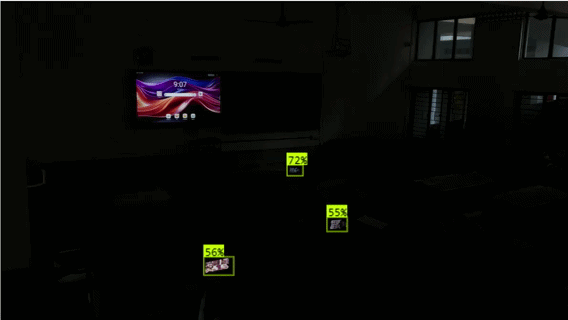

# 🎥 TAPACD - Theater Anti-Piracy AI Camera Detection

**TAPACD** (Theater Anti-Piracy AI Camera Detection) is an AI-based real-time monitoring system designed to **alert security when a mobile phone is detected** inside restricted zones like theaters. The system uses a trained YOLOv8 model to automatically detect phones through a webcam feed and **captures evidence images** after continuous detection.

---

##  Project Overview

- Monitors live video from a webcam.
- Detects mobile phones using a YOLOv8 deep learning model.
- If a phone is detected continuously for a set duration (e.g., 7 seconds), it:
  - **Captures an image**
  - **Plays a beep alert to notify security**
  - **Logs the image for review**

---

##  How It Works

1. Webcam streams real-time video.
2. Each frame is analyzed for mobile phone detection.
3. If detection continues for the threshold time:
   - A beep sound alerts nearby security personnel.
   - The current frame is saved as evidence.
4. All captured images are stored in a folder and accessible via a web API.

---

##  Model & Dataset

- The YOLOv8 model used in this project was trained on a **custom dataset**.
- The dataset was **manually labeled using [Roboflow](https://roboflow.com/)** to include images of mobile phones under various conditions.
- The dataset covers:
  - Bright environments
  - Dark and low-light conditions
  - Multiple angles and phone orientations

---

## 🌐 Backend Features

- `/video_feed` – Streams live video feed with bounding boxes
- `/logs` – Lists all captured image filenames
- `/images/<filename>` – Serves specific captured images

---

##  Captured Evidence

- All evidence is saved in the `captured_images/` folder
- Files are uniquely named using UUIDs
- Images are time-stamped and useful for audits

---

##  Use Case

- Movie theaters (to prevent piracy)
- Exam halls (to detect cheating)
- Confidential meetings or restricted areas

---

##  Security Alerts

- **Beep alert** when detection is confirmed
- Bounding boxes and confidence scores on detected phones
- Captured images available via frontend and logs

---

##  Benefits

- Real-time, automated mobile detection
- Reduces manual monitoring effort
- Stores visual proof of policy violations
- Easily integrable with web frontends

---

##  Screenshots

### 🔆 Bright Lighting Condition


### 🌘 Dark Lighting Condition


### 🌫️ Dim Lighting Detection


### 🎞️ Real-time Detection Frame


### 🧩 Flowchart of System Architecture


### 💻 Frontend Screenshot


---

## 🎥 Demo Videos

### 📡 Real-time Detection in Action
[▶️ Watch Video](sample%20screenshots/realtime%20detection%20video%20sample.mp4)

### 🌒 Phone Recognition in Dark Condition
[▶️ Watch Video](sample%20screenshots/recognition%20in%20dark%20condition%20with%20good%20confidence.mp4)


---

## 🛠️ Tech Stack

- Python + Flask (Backend)
- YOLOv8 (Object Detection)
- OpenCV (Webcam Feed)
- Roboflow (Dataset Creation)
- HTML/CSS/JS or React (Frontend - optional)

---

## 📁 Folder Structure (Simplified)

```
TAPACD/
├── app.py
├── best8m.pt
├── captured_images/
├── sample screenshots/
│   ├── bright condition.png
│   ├── dark condition.png
│   ├── dim condition.png
│   ├── captured samples.png
│   ├── frontend.png
│   ├── flowchart.png
│   ├── realtime detection video sample.mp4
│   └── recognition in dark condition with good confidence.mp4
```

---

## 📌 CONTRIBUTERS

**Irfan PJ**  
AI & Data Science Student, MESCE  
[GitHub](https://github.com/IrfanPJ) | [LinkedIn](https://www.linkedin.com/in/irfanpj)

**Lena Babu**  
AI & Data Science Student, MESCE  
[GitHub](https://github.com/lenababu) | [LinkedIn](https://www.linkedin.com/in/lenababu/)

**Irfan Mubarak**  
AI & Data Science Student, MESCE  
[GitHub](https://github.com/irfanmubarak30) | [LinkedIn](https://www.linkedin.com/in/irfan-mubarak-k/)

---
